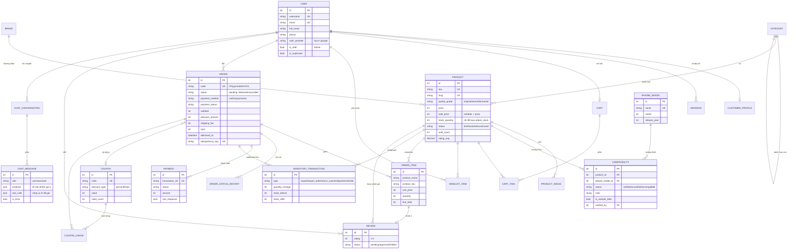

# Sơ đồ quan hệ dữ liệu (ERD) – iParts Store

```mermaid
erDiagram
    USER ||--o| CUSTOMER_PROFILE : "có"
    USER ||--o{ ADDRESS : "sổ địa chỉ"
    USER ||--o| CART : "sở hữu"
    CART ||--o{ CART_ITEM : "gồm"
    USER ||--o{ WISHLIST_ITEM : "yêu thích"
    USER ||--o{ ORDER : "đặt"
    USER ||--o{ REVIEW : "viết"
    USER ||--o{ CHAT_CONVERSATION : "trò chuyện"

    CATEGORY ||--o{ CATEGORY : "danh mục con"
    CATEGORY ||--o{ PRODUCT : "phân loại"
    BRAND ||--o{ PRODUCT : "thương hiệu"
    PRODUCT ||--o{ PRODUCT_IMAGE : "ảnh"
    PRODUCT ||--o{ COMPATIBILITY : "tương thích"
    IPHONE_MODEL ||--o{ COMPATIBILITY : "tương thích"
    PRODUCT ||--o{ CART_ITEM : ""
    PRODUCT ||--o{ WISHLIST_ITEM : ""
    PRODUCT ||--o{ ORDER_ITEM : "snapshot"
    PRODUCT ||--o{ INVENTORY_TRANSACTION : "nhập/xuất"
    PRODUCT ||--o{ REVIEW : "được đánh giá"

    ORDER ||--o{ ORDER_ITEM : "gồm"
    ORDER ||--o{ ORDER_STATUS_HISTORY : "lịch sử"
    ORDER ||--o{ PAYMENT : "thanh toán"
    ORDER ||--o{ INVENTORY_TRANSACTION : "xuất/hoàn kho"
    ORDER }o--o| COUPON : "áp dụng"
    COUPON ||--o{ COUPON_USAGE : "lượt dùng"
    ORDER ||--o{ COUPON_USAGE : ""
    ORDER_ITEM ||--o| REVIEW : "tối đa 1"

    CHAT_CONVERSATION ||--o{ CHAT_MESSAGE : "gồm"

    USER {
        int id PK
        string username UK
        string email UK
        string full_name
        string phone
        string auth_provider "local / google"
        bool is_staff "Admin"
        bool is_superuser
    }
    PRODUCT {
        int id PK
        string sku UK
        string slug UK
        string quality_grade "original/oem/aftermarket"
        int price
        int sale_price "nullable, < price"
        int stock_quantity "chỉ đổi qua adjust_stock"
        string status "draft/active/discontinued"
        int sold_count
        decimal rating_avg
    }
    IPHONE_MODEL {
        int id PK
        string name UK
        int series
        int release_year
    }
    COMPATIBILITY {
        int id PK
        int product_id FK
        int iphone_model_id FK
        string status "verified/unverified/incompatible"
        string note
        bool is_sample_data
        int verified_by FK
    }
    ORDER {
        int id PK
        string code UK "IPSyymmddXXXXX"
        string status "pending..delivered/cancelled"
        string payment_method "cod/vnpay/momo"
        string payment_status
        int subtotal
        int discount_amount
        int shipping_fee
        int total
        datetime delivered_at
        string idempotency_key UK
    }
    ORDER_ITEM {
        int id PK
        string product_name
        string product_sku
        int unit_price
        int quantity
        int line_total
    }
    PAYMENT {
        int id PK
        string transaction_ref UK
        string status
        int amount
        json raw_response
    }
    INVENTORY_TRANSACTION {
        int id PK
        string type "import/export_order/return_cancel/adjustment/initial"
        int quantity_change
        int stock_before
        int stock_after
    }
    COUPON {
        int id PK
        string code UK
        string discount_type "percent/fixed"
        int value
        int used_count
    }
    REVIEW {
        int id PK
        int rating "1-5"
        string status "pending/approved/hidden"
    }
    CHAT_MESSAGE {
        int id PK
        string role "user/assistant"
        json products "ID sản phẩm gợi ý"
        json tool_calls "công cụ AI đã gọi"
        bool is_error
    }
```

Các bảng singleton/nội dung độc lập: `StoreSetting`, `ChatbotSetting`, `Page`, `FAQ`, `Banner`, `NewsletterSubscriber`, `ContactMessage`.
